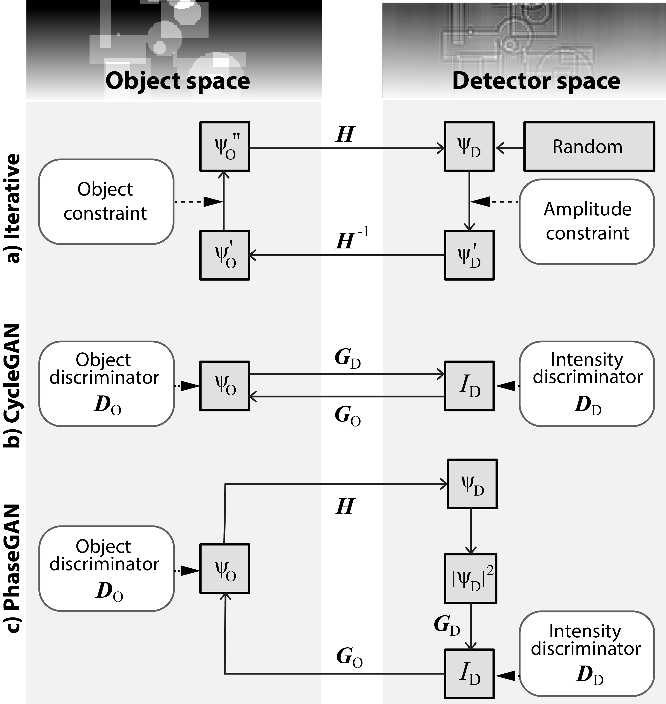

# PhaseGAN: A deep-learning phase-retrieval approach for unpaired datasets
PhaseGAN is a deep-learning phase-retrieval approach allowing the use of unpaired datasets and includes the physics of image formation. Please check out our [PhaseGAN paper](https://arxiv.org/abs/2011.08660) for more details.  



The training data should be kept in ./dataset. 
We used .h5 data format for the original training. Customized dataloader could be used for the training with other data formats. 
To run the training: python3 train.py, results will be saved in ./results/fig. 


 

## Citation
If you use this code for your research, please cite our paper.
```
@article{zhang2020phasegan,
  title={PhaseGAN: A deep-learning phase-retrieval approach for unpaired datasets},
  author={Zhang, Yuhe and Noack, Mike Andreas and Vagovic, Patrik and Fezzaa, Kamel and Garcia-Moreno, Francisco and Ritschel, Tobias and Villanueva-Perez, Pablo},
  journal={arXiv preprint arXiv:2011.08660},
  year={2020}
}


Our code is based on [pytorch-CycleGAN-and-pix2pix](https://github.com/junyanz/pytorch-CycleGAN-and-pix2pix) and [TernausNet](https://github.com/ternaus/TernausNet).
