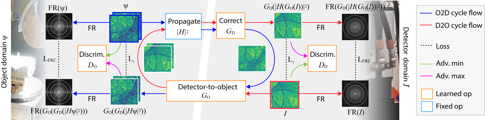
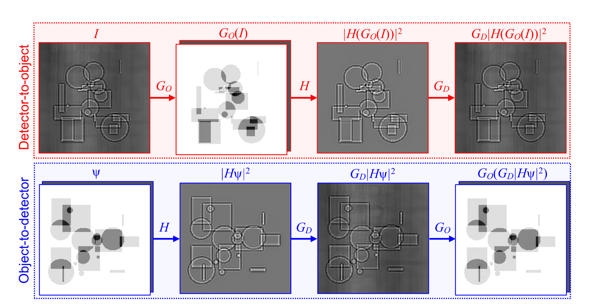

# PhaseGAN
PhaseGAN is a deep-learning phase-retrieval approach allowing the use of unpaired datasets and includes the physics of image formation. 
This repository contains code for the paper [PhaseGAN: A deep-learning phase-retrieval approach for unpaired datasets](https://arxiv.org/abs/2011.08660).

<p align="center">


</p>

## Colab Notebook
PhaseGAN Tutorial [Google Colab](https://colab.research.google.com/github/pvilla/PhaseGAN/blob/master/PhaseGAN_Notebook.ipynb) | [Code](https://github.com/pvilla/PhaseGAN/blob/master/PhaseGAN_Notebook.ipynb)

## Getting Started
### Prerequisites

- Linux (not tested for MacOS or Windows)
- Python3
- NVIDIA GPU (CPU not tested)

### Installation

Clone this repo:

```
git clone https://github.com/pvilla/PhaseGAN.git
cd PhaseGAN
```
To install the required python packages:

```
pip install -r requirements.txt
```

### PhaseGAN training
For the training, our provided data loader [Dataset2channel.py](https://github.com/pvilla/PhaseGAN/blob/master/dataset/Dataset2channel.py) support loading data with HDF5 format. An example of the dataset structure could be find in [Example dataset folder](https://github.com/pvilla/PhaseGAN/tree/master/dataset/example_dataset) and [PhaseGAN validation dataset (Google Drive)](https://drive.google.com/drive/folders/1rKTZYJa54WeG-2TikoXpdRcqTiSQ-Ps5?usp=sharing).
We used hdf5 data format for the original training. For the training with other data formats, you may want to create a customized data loader. 
results will be saved in ./results/fig. 


To run the training:

`python3 train.py`

For more training options, please check out:

`python3 train.py --help`

### Results
The training results will be saved in: `./results/fig/run_name/train`.
The training parameters and losses will be saved to a txt file here: `./results/fig/run_name/log.txt`.
The models will be saved in `./results/fig/run_name/save.`

 

## Citation
If you use this code for your research, please cite our paper.
```
@article{zhang2020phasegan,
  title={PhaseGAN: A deep-learning phase-retrieval approach for unpaired datasets},
  author={Zhang, Yuhe and Noack, Mike Andreas and Vagovic, Patrik and Fezzaa, Kamel and Garcia-Moreno, Francisco and Ritschel, Tobias and Villanueva-Perez, Pablo},
  journal={arXiv preprint arXiv:2011.08660},
  year={2020}
}
```

Our code is based on [pytorch-CycleGAN-and-pix2pix](https://github.com/junyanz/pytorch-CycleGAN-and-pix2pix) and [TernausNet](https://github.com/ternaus/TernausNet).
